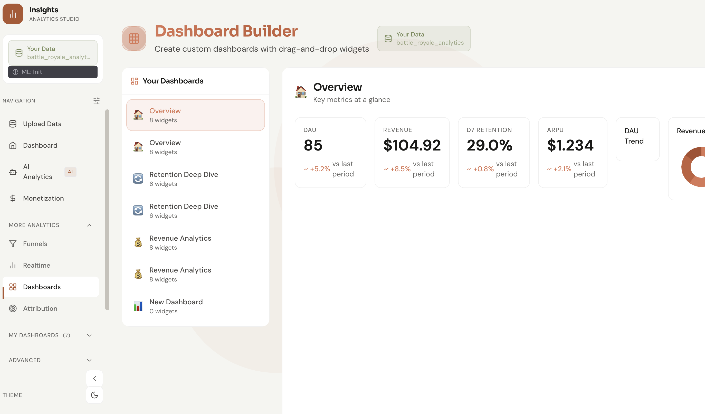
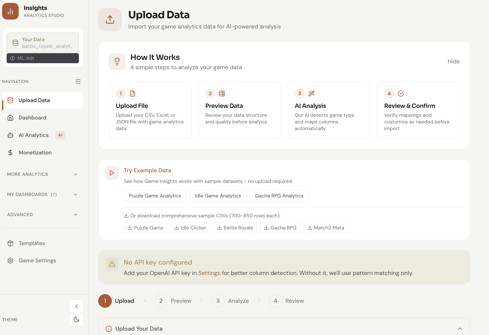
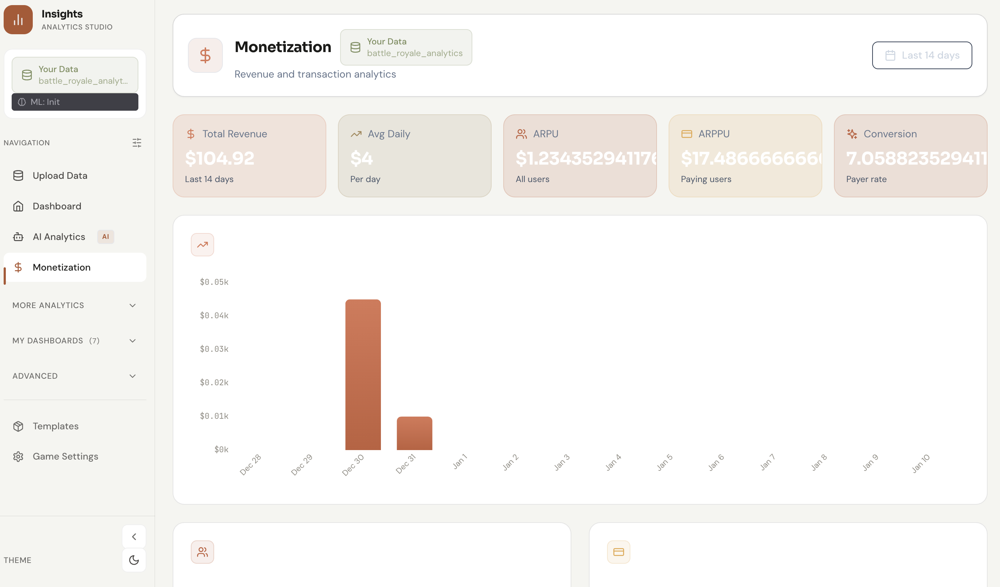
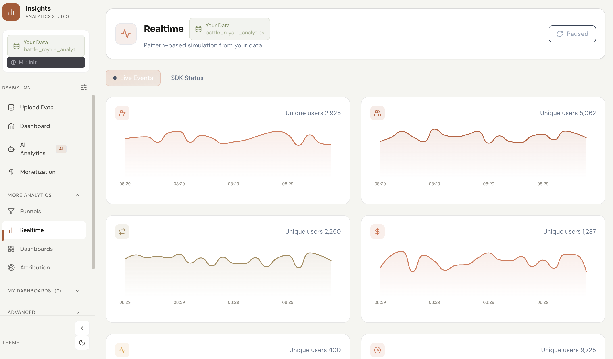
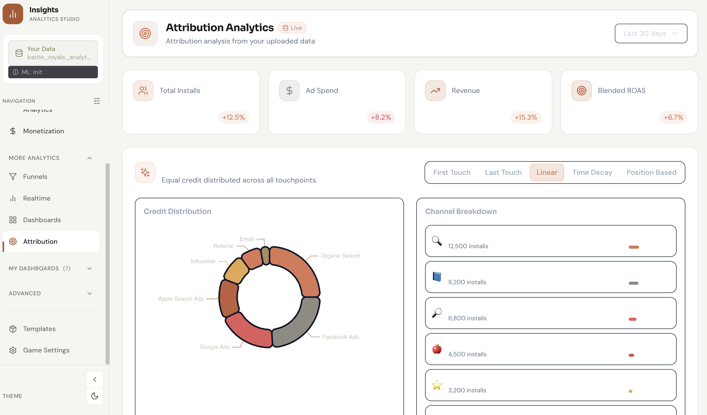
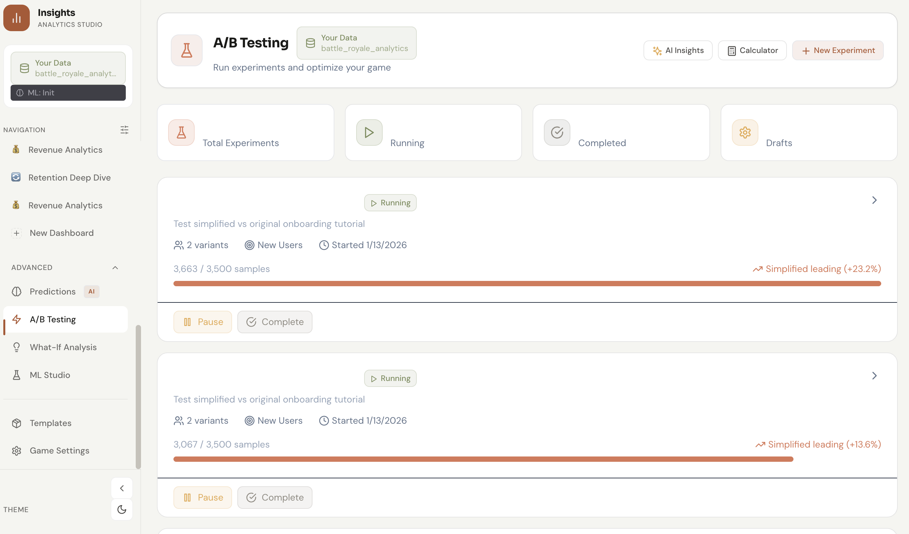
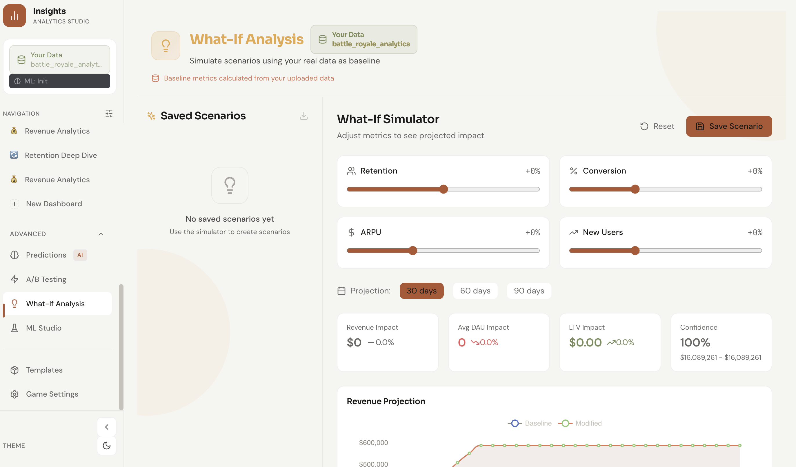
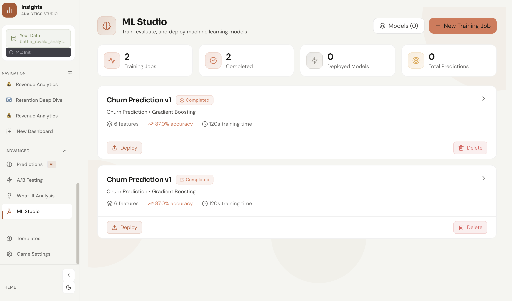
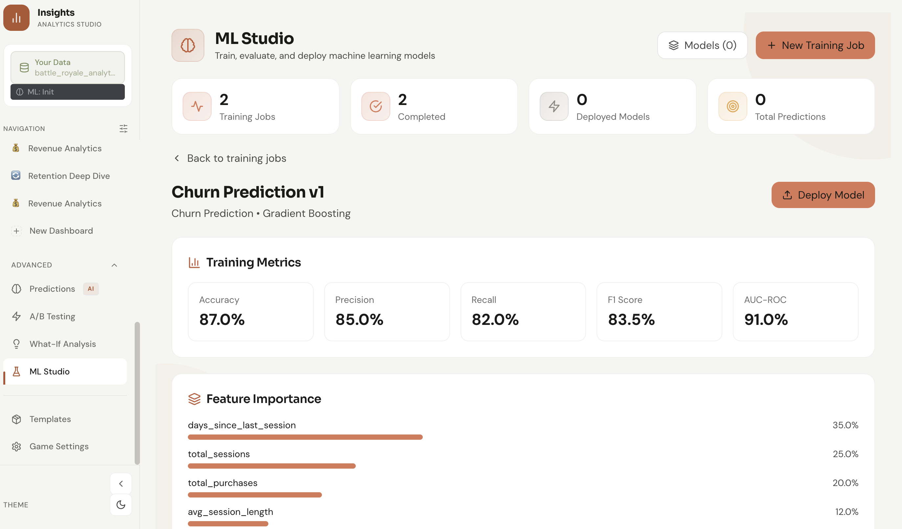

# Game Insights

**Open-source analytics platform for indie game developers.**

Upload your game data, get instant insights. No data engineering required.

[](https://opensource.org/licenses/MIT)
[](https://www.typescriptlang.org/)
[](https://reactjs.org/)

<p align="center">
  
</p>

---

## Why Game Insights?

Indie developers are at a massive disadvantage when it comes to analytics:

- Big studios have dedicated data teams
- Enterprise tools cost $10k+/month
- Building custom analytics takes months
- Data comes from dozens of different sources

**Game Insights levels the playing field.**

---

## Features at a Glance

| Feature | Description |
|---------|-------------|
| **Zero-Config Import** | Drag & drop CSV, Excel, JSON - AI maps your columns automatically |
| **Game Type Detection** | Auto-detects puzzle, idle, RPG, battle royale, and more |
| **Custom Dashboards** | Build dashboards with drag-and-drop widgets |
| **ML Studio** | Train churn prediction models without code |
| **Real-time Monitoring** | Live event streams and SDK status |
| **A/B Testing** | Run experiments and track statistical significance |

---

## Screenshots

### Data Import

Upload your game data with our guided 4-step wizard. Supports CSV, Excel, JSON, and SQLite files with automatic column detection.

<p align="center">
  
</p>

---

### Dashboard Builder

Create custom dashboards with drag-and-drop widgets. Pre-built templates for common analytics needs.

<p align="center">
  
</p>

---

### Monetization Analytics

Track revenue, ARPU, ARPPU, and conversion rates. Visualize daily revenue trends and identify opportunities.

<p align="center">
  
</p>

---

### Real-time Monitoring

Monitor live events from your game with pattern-based simulation. Track unique users across different event types.

<p align="center">
  
</p>

---

### Attribution Analytics

Understand where your players come from. Multi-touch attribution models including First Touch, Last Touch, Linear, Time Decay, and Position Based.

<p align="center">
  
</p>

---

### A/B Testing

Run experiments and optimize your game. Track variants, sample sizes, and statistical significance in real-time.

<p align="center">
  
</p>

---

### What-If Analysis

Simulate scenarios using your real data as baseline. Adjust retention, conversion, ARPU, and new users to project revenue impact.

<p align="center">
  
</p>

---

### ML Studio

Train, evaluate, and deploy machine learning models. Build churn prediction models with Gradient Boosting - no ML expertise required.

<p align="center">
  
</p>

View detailed training metrics including accuracy, precision, recall, F1 score, and feature importance.

<p align="center">
  
</p>

---

## Quick Start

### Prerequisites

- Node.js 18+
- pnpm (recommended) or npm

### Installation

```bash
# Clone the repository
git clone https://github.com/efeecllk/game-insights.git
cd game-insights

# Install dependencies
pnpm install

# Start development server
pnpm dev
```

Open [http://localhost:5173](http://localhost:5173) and upload a CSV to get started.

### Try with Sample Data

Click "Try Example Data" on the upload page to explore with pre-loaded datasets:

- **Puzzle Game Analytics** - Level completions and booster usage
- **Idle Game Analytics** - Prestige tracking and offline rewards
- **Gacha RPG Analytics** - Banner pulls and spender tiers

---

## Game Types Supported

Game Insights auto-detects your game type and optimizes the dashboard accordingly:

| Game Type | Key Metrics | Unique Features |
|-----------|-------------|-----------------|
| **Puzzle** | Level progression, booster usage | Difficulty curves, level funnels |
| **Idle** | Prestige rate, offline time | Session patterns, progression speed |
| **Battle Royale** | Rank distribution, weapon meta | Competitive metrics, match balance |
| **Match-3** | Lives economy, hard levels | Story progression, decoration |
| **Gacha RPG** | Banner performance, pity tracking | Hero collection, spender tiers |

---

## Tech Stack

| Category | Technology |
|----------|------------|
| **Framework** | React 18 + TypeScript |
| **Build** | Vite 5 |
| **Styling** | Tailwind CSS 3.4 + CSS Variables |
| **Animation** | Framer Motion 10 |
| **Charts** | ECharts 5 |
| **State** | React Context + IndexedDB |
| **Testing** | Vitest + Playwright |
| **Components** | Storybook 10 |

---

## Project Structure

```
game-insights/
├── src/
│   ├── adapters/        # Data source connectors
│   ├── ai/              # AI pipeline (schema analysis, game detection, ML)
│   ├── components/      # Reusable UI components
│   ├── context/         # React context providers
│   ├── hooks/           # Custom React hooks
│   ├── lib/             # Utilities, importers, data providers
│   ├── pages/           # Page components
│   └── types/           # TypeScript definitions
├── docs/
│   ├── screenshots/     # Application screenshots
│   ├── plans/           # Feature implementation plans
│   └── phases/          # Development phases
└── tests/               # Test suites
```

---

## Available Commands

```bash
# Development
pnpm dev              # Start dev server (http://localhost:5173)
pnpm build            # TypeScript check + production build
pnpm preview          # Preview production build

# Code Quality
pnpm lint             # Run ESLint
pnpm test             # Run unit tests
pnpm test:coverage    # Run tests with coverage
pnpm test:e2e         # Run Playwright E2E tests

# Documentation
pnpm storybook        # Start Storybook (http://localhost:6006)
```

---

## Architecture

```
Data Source → Adapter → AI Pipeline → Dashboard
```

1. **Adapters** - Unified interface for CSV, Excel, JSON, SQL, and API data sources
2. **AI Pipeline** - Schema analysis, game type detection, data cleaning, insight generation
3. **Dashboard** - Auto-generated visualizations based on your game type

See [docs/ARCHITECTURE.md](./docs/ARCHITECTURE.md) for detailed architecture.

---

## Design Principles

1. **Zero-Config First** - Works for 90% of users without configuration
2. **Progressive Disclosure** - Simple by default, power features available
3. **Local-First** - Your data stays on your machine unless explicitly shared
4. **Game Developer Focus** - Every feature designed for game analytics

---

## Contributing

We welcome contributions! See [CONTRIBUTING.md](./CONTRIBUTING.md) for guidelines.

### Areas for Contribution

- **Data Adapters** - Add support for new data sources
- **AI Improvements** - Better game detection, more semantic types
- **Visualizations** - New chart types, dashboard layouts
- **Documentation** - Tutorials, examples, translations

---

## License

MIT License - Use it however you want.

---

## Support

- **Issues**: [GitHub Issues](https://github.com/efeecllk/game-insights/issues)
- **Discussions**: [GitHub Discussions](https://github.com/efeecllk/game-insights/discussions)

---

<p align="center">
  <strong>Made for indie devs, by indie devs.</strong>
</p>
