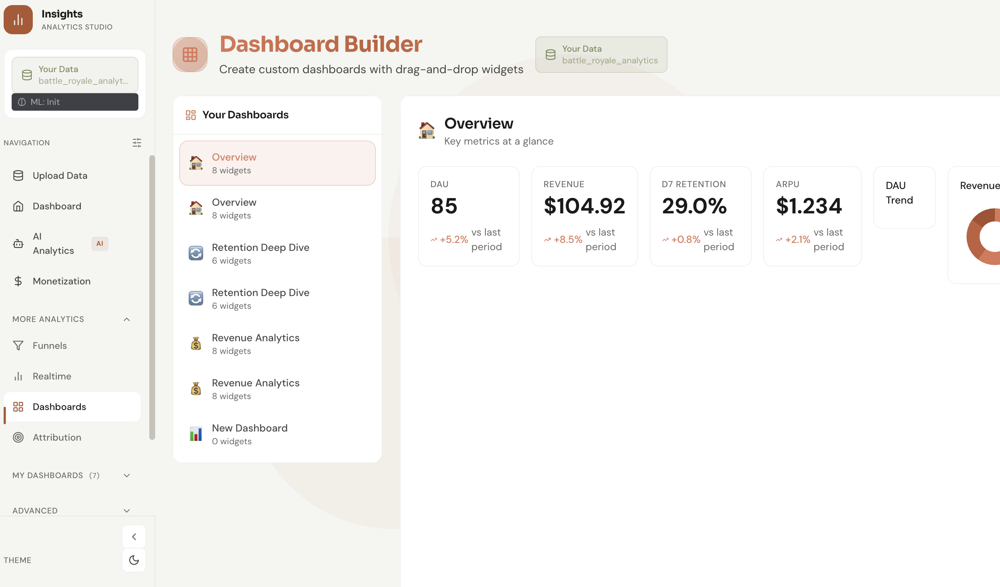

# Game Insights

Game Insights is a local-first analytics app for game teams. It imports tabular data, detects the game type, runs AI-assisted analysis, and surfaces dashboards for upload, funnels, monetization, games, and settings.

[](https://opensource.org/licenses/MIT)
[](https://www.typescriptlang.org/)
[](https://reactjs.org/)

<p align="center">
  
</p>

## What It Does

- Imports CSV, TSV, JSON, NDJSON, Excel, and SQLite data
- Supports file upload, URL import, clipboard import, and folder import
- Auto-detects game type and maps columns with AI-assisted analysis
- Persists data locally in the browser
- Surfaces specialized views for funnels, monetization, AI analytics, games, and dashboard building

## Key Screens

- `Upload` for importing and reviewing data
- `AI Analytics` for insights, anomalies, and Q&A
- `Funnels` for detected or manual funnel analysis
- `Monetization` for revenue and payer analysis
- `Dashboard Builder` for custom dashboards
- `Games` for multi-game management
- `Settings` for theme, language, and AI provider configuration
- `Landing` for the public marketing page

## Repository Structure

```text
src/
├── ai/              # App analytics engine: schema, metrics, funnels, cohorts, recommendations
├── adapters/        # Data source adapters
├── components/      # Shared UI, upload flow, charts, landing, settings
├── context/         # React state providers
├── hooks/           # Shared hooks for analytics, onboarding, keyboard shortcuts
├── lib/             # Importers, stores, persistence, utilities, sample data
├── pages/           # Route-level screens
├── services/ai/     # LLM provider orchestration, prompts, chains, tools, memory
├── services/openai.ts
└── types/           # Shared TypeScript types
```

The two AI areas are intentionally separate:

- `src/ai` contains domain analytics used by the app itself
- `src/services/ai` contains provider-backed LLM orchestration

## Quick Start

### Prerequisites

- Node.js 18+
- `pnpm`

### Install and run

```bash
pnpm install
pnpm dev
```

Open `http://localhost:5173`.

### Sample data

On the upload page, use `Try Example Data` to load one of the built-in datasets:

- Puzzle Game Analytics
- Idle Game Analytics
- Gacha RPG Analytics

## Commands

```bash
pnpm dev             # Start the Vite dev server
pnpm build           # TypeScript check + production build
pnpm lint            # ESLint
pnpm test            # Vitest in watch mode
pnpm test:run        # Vitest once, then cleanup
pnpm test:coverage   # Vitest with coverage
pnpm test:e2e        # Playwright end-to-end tests
pnpm storybook       # Storybook
pnpm build-storybook # Build Storybook static output
```

## Architecture

The current app flow is:

`Upload / sample data -> importer -> local storage -> AI analysis -> dashboard screens`

Core modules involved in that flow:

- `src/lib/importers/` parses supported file and text sources
- `src/lib/dataStore.ts` and `src/lib/db.ts` handle local persistence
- `src/lib/columnAnalyzer.ts` bridges optional AI-backed column analysis
- `src/ai/` computes metrics, funnels, cohorts, recommendations, and report outputs
- `src/services/ai/` wraps provider configuration, prompts, chains, tools, and memory
- `src/context/` holds app-wide state for data, games, theme, and toasts

## Design Notes

- The app uses CSS variables for the warm theme in `src/index.css`
- Most dashboards and flows are code-split with `React.lazy`
- Shared UI lives in `src/components/ui/`

## Related Docs

- [Architecture](./docs/ARCHITECTURE.md)
- [Usage Guide](./docs/USAGE.md)
